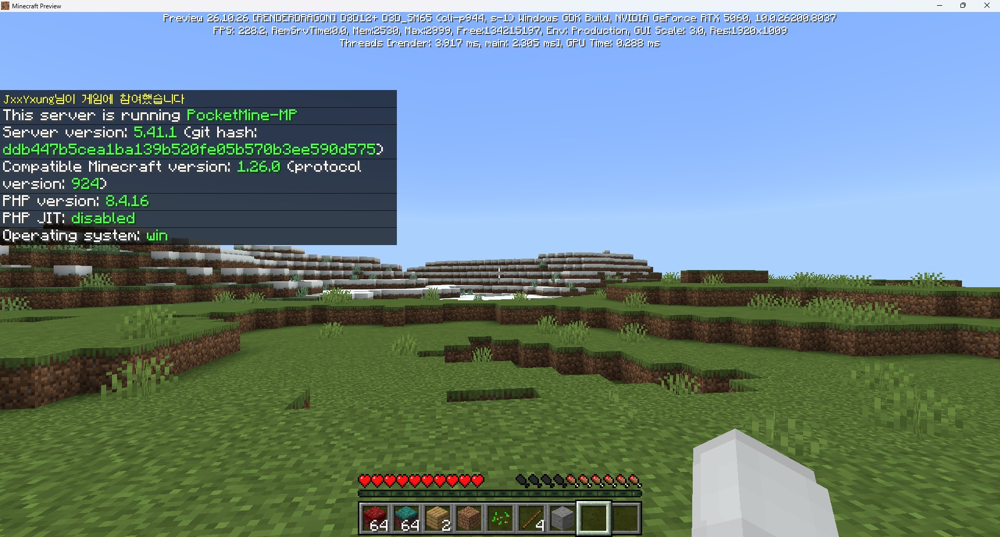

# NexusPM

**Multi-version protocol support plugin for PocketMine-MP.**

Allows newer Minecraft Bedrock clients to connect to PMMP servers running an older protocol version. Translates network packets, block palettes, and item tables between protocol versions at runtime.


*Minecraft Preview v1.26.10 (protocol 944) connected to PocketMine-MP v1.26.0 (protocol 924)*

## Features

- **Transparent multi-version support** — Newer clients connect and play without manual server updates
- **Block palette translation** — 14,000+ block runtime IDs remapped per version
- **Chunk data rewriting** — Compressed chunk batches intercepted and rewritten in real-time
- **Item table remapping** — Item runtime IDs translated while preserving custom item data
- **Y-coordinate encoding fix** — Handles block position encoding changes across versions
- **Sound & particle correction** — Block-related sounds and particles use correct runtime IDs
- **Custom item/block compatibility** — Works with plugins like CustomItemLoader

## Supported Versions

| Protocol | Minecraft Version | Status |
|----------|------------------|--------|
| 924 | 1.26.0 | Base (native PMMP) |
| 944 | 1.26.10 | Supported |

## Requirements

- PocketMine-MP 5.x
- PHP 8.1+
- [DevTools](https://poggit.pmmp.io/p/DevTools) plugin (for folder plugin loading)

## Installation

1. Clone into your server's `plugins/` directory:
   ```
   cd plugins/
   git clone https://github.com/ahnsunggwan45/NexusPM.git
   ```

2. Start the server. NexusPM will automatically:
   - Replace the default network interface
   - Load block palette and item table data for each supported version
   - Accept connections from all supported protocol versions

## How It Works

NexusPM uses the **network layer replacement** approach:

```
v944 Client (1.26.10)
    ↓ v944 format packets
[NexusPM — Block ID / Y-coord / Item ID translation]
    ↓ v924 format packets
PMMP Server (1.26.0)
    ↓ v924 format packets
[NexusPM — Reverse translation]
    ↓ v944 format packets
v944 Client (1.26.10)
```

### Key Components

- **NexusRakLibInterface** — Replaces PMMP's RakLibInterface to create custom sessions
- **NexusNetworkSession** — Intercepts compressed chunk batches and item registry packets
- **PacketTranslationHelper** — Centralizes block ID and coordinate translation for all packets
- **ChunkRewriter** — Rewrites block runtime IDs in SubChunk palette data
- **NexusBlockTranslator** — 2-step block translation (internal state → target runtime ID)

### Data Sources

- **[Kaooot/bedrock-network-data](https://github.com/Kaooot/bedrock-network-data)** — Block palette & item table data
- **[CloudburstMC/Protocol](https://github.com/CloudburstMC/Protocol)** — Protocol version codec definitions
- **[Nightfall-MCPE/MultiVersion](https://github.com/Nightfall-MCPE/MultiVersion)** — Network layer replacement architecture

## License

MIT License
